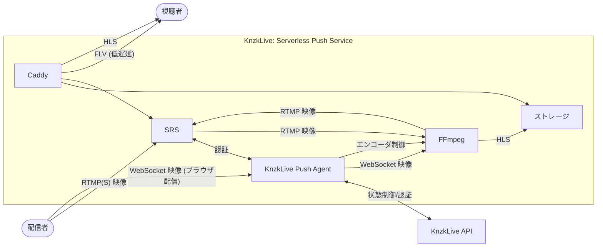

# knzklive2/push-serverless (push v3)

> (Super experimental) KnzkLive: Serverless Push Service

⚠ This is a experimental service and sometimes it is exploded.

## Concepts

- 主に fly.io 上で動作させる事を目的としたサーバーレスプッシュサービスの実験です
  - プッシュサーバーに必要なプロセスを一つのイメージに全て詰め込み、無理やり一つの Firecracker VM 上で動作させます
- 使用者がいないときはゼロスケールしインフラコストを極限まで抑えることに焦点を当てています
- Fly Proxy によって TLS 接続を生の TCP に変換させる事で、間接的に RTMPS に対応します

## Spec

- 以下のプロセスが一つの Firecracker VM 内で動作します
  - Caddy - 静的ファイルの配信とリバースプロキシ
  - SRS - RTMP サーバー
  - KnzkLive Push Agent - 制御基盤
  - FFmpeg - ビデオエンコーダ

## Limitations

- 水平方向へのスケーリングは行えません
  - 現状の設計だと根本的にできないので、v4 作るときは設計からやり直したさがある
